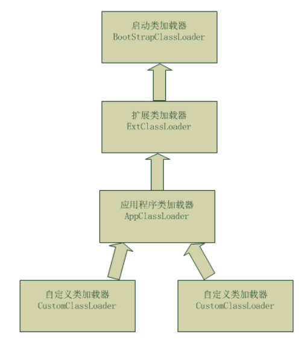

# 相关问题解答

### BeanFactory和FactoryBean的区别？

**BeanFactory 以Factory结尾，表示它是一个工厂类，用于管理Bean的一个工厂在Spring中，所有的Bean都是由BeanFactory(也就是IOC容器)来进行管理的。但对FactoryBean而言，这个Bean不是简单的Bean，而是一个能生产或者修饰对象生成的工厂Bean**

**简单来说BeanFactoy的getBean方法可以创建出普通Bean和FactoyBean，FactoryBean再通过getObject()方法创建出Bean**


### BeanFactory和上下文之间的关系？

**BeanFactory是最基本的Bean工厂，通过getBean获得Bean，而Context是对BeanFactory的封装和继承，提供了更多面向实际应用的功能**

### **IOC中三级缓存能不能换成两级，即去掉中间的earlySingletonObjects？**

```
private final Map<String,Object> singletonObjects=new ConcurrentHashMap<>();

private  final Map<String,Object> earlySingletonObjects=new ConcurrentHashMap<>();

private  final Map<String, ObjectFactory<?>>singletonFactories=new HashMap<String, ObjectFactory<?>>(16);
```

**在我写的SmallSpring中其实两级缓存就够用了，三级缓存主要为了增添扩展性，如果在参数配置前进行了生成代理对象的话，依赖对象所拿到的Bean应该也是代理的，不过这其实也不影响三层，只是如果最终的SingleObject需要是原对象而不是代理对象的话，earlySingletonObjects这一层就必须带着了，不然会引起冲突**


### IOC中获得类加载器为什么使用Thread.currentThread().getContextClassLoader()方法？Class.getClassLoader()区别？

**因为前者是最安全的写法，其实对于程序中是没区别的，主要不同的情况在于，jar、resources都是由指定的类加载器来加载的比如Tomcat运行首先是执行Tomcat org.apache.catalina.startup.Bootstrap类，这时候的类加载器是ClassLoader.getSystemClassLoader()。而我们后面的WEB程序，里面的jar、resources都是由Tomcat内部来加载的，这时两者就会出现不一致的现象，再复习下jvm类加载机制（双亲委派）**




**双亲委派机制得工作过程：**

**1-类加载器收到类加载的请求；**

**2-把这个请求委托给父加载器去完成，一直向上委托，直到启动类加载器；**

**3-启动器加载器检查能不能加载（使用findClass()方法），能就加载（结束）；否则，抛出异常，通知子加载器进行加载。**

**4-重复步骤三；**


### **Java动态代理和CGLIB的区别？**

**1）JDK动态代理只能对实现了接口的类生成代理，而不能针对类。**

**2）CGLIB是针对类实现代理，主要是对指定的类生成一个子类，覆盖其中的方法，**

 **并覆盖其中方法实现增强，但是因为采用的是继承，所以该类或方法最好不要声明成final，** **对于final类或方法，是无法继承的。**

**使用CGLib实现动态代理，CGLib底层采用ASM字节码生成框架，使用字节码技术生成代理类**

**Jdk动态代理利用拦截器(拦截器必须实现InvocationHanlder)加上反射机制生成一个实现代理接口的匿名类，**

**在调用具体方法前调用InvokeHandler来处理。**


### **项目运用到的设计模式？**


#### 工厂模式

**这个不用说，所有的Bean都是通过BeanFactory的子类进行加工得来的**


```
public Object getBean(String name)  {
    return getBeanFactory().getBean(name);
}
```


#### 装饰模式

**这个也是基本每个程序都用到了，举个例子就下面的对BeanDefinition的解析实际方法时通过Delegate来完成的，但是外部调用的确实BeanDefinitionDocumentReader的方法**


```
public class DefaultBeanDefinitionDocumentReader implements  BeanDefinitionDocumentReader {
    private static final String BEAN_ELEMENT ="bean";
    BeanDefinitionParserDelegate delegate=new BeanDefinitionParserDelegate();
    private BeanDefinitionReader beanDefinitionReader;
```


#### 单例模式

**在PointCut中如果是想不进行检验切点而是直接判定可以织入的话，则可以用TruePointcut，这个就是单例模式生成的**


```
public class TruePointcut implements  Pointcut {
    private TruePointcut() {
    }
    static  final  Pointcut INSTANCE = new TruePointcut();
```


#### 适配器模式

**XML配置的advisor不是直接可用的，需要通过适配器将其转换成相应的MethodInterceptor**


```
public class MethodBeforeAdviceAdapter implements  AdvisorAdapter {
    @Override
    public boolean supportAdvice(Advice advice) {
        return  advice instanceof MethodBeforeAdvice;
    }

    @Override
    public MethodInterceptor getInterceptor(Advisor advisor) {
        MethodBeforeAdvice methodBeforeAdvice=(MethodBeforeAdvice)advisor.getAdvice();
        return  new MethodBeforeAdviceInterceptor(methodBeforeAdvice);
    }
}
```

#### **代理模式**

**AOP天生代理不用说**


```
public class JdkDynamicAopProxy implements AopProxy , InvocationHandler {
    public JdkDynamicAopProxy(AdvisedSupport advised) {
        this.advised = advised;
    }

    AdvisedSupport advised;
    @Override
    public Object invoke(Object proxy, Method method, Object[] args) throws Throwable {
        TargetSource targetSource=this.advised.getTargetSource();
        Object target=targetSource.getTarget();
        Class<?>targetClass=targetSource.getTargetClass();
        MethodInvocation methodInvocation;
        List<?> chain=this.advised.getIntetceptorsAndDynamicInterceptionAdvice(method,targetClass);
        methodInvocation=new ReflectiveMethodInvocation(args,target,method,proxy,chain);
        return methodInvocation.proceed();
    }

    @Override
    public Object getProxy() {
        Class<?>[]Interfaces=advised.getTargetSource().getTargetClass().getInterfaces();
        return Proxy.newProxyInstance(Thread.currentThread().getContextClassLoader(),Interfaces,this);
    }

}
```


#### **职责链模式**

**在AOP中代理方法的实现是通过链式实现的，链中不同接口的方法会在真正target方法的前面或后面完成**


```
public Object proceed() throws Throwable {
    if(this.currentInterceptorIndex==this.interceptorsAndMDynamicMethodMatchers.size()-1)
    {
        return  invokeJoinPoint();
    }
    Object advice=this.interceptorsAndMDynamicMethodMatchers.get(++this.currentInterceptorIndex);

    return ((MethodInterceptor)advice).invoke(this);
}
```


```
public class MethodBeforeAdviceInterceptor implements MethodInterceptor {
    private MethodBeforeAdvice advice;

    public MethodBeforeAdviceInterceptor(MethodBeforeAdvice advice) {
        this.advice=advice;
    }

    @Override
    public Object invoke(MethodInvocation invocation) {
        this.advice.Before(invocation.getMetod(),invocation.getArguments(),invocation.getThis());
        try {
            return  invocation.proceed();
        } catch (Throwable throwable) {
            throwable.printStackTrace();
        }
        return null;

    }
}
```