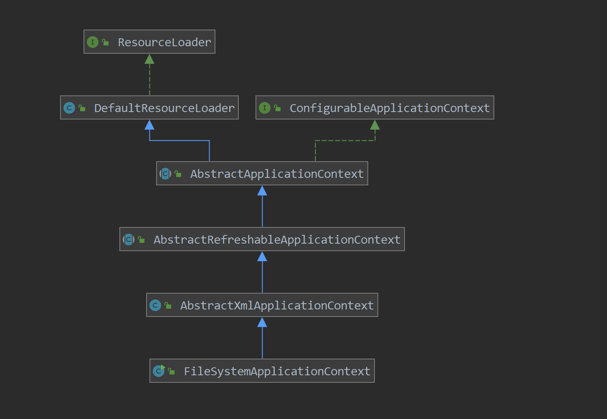
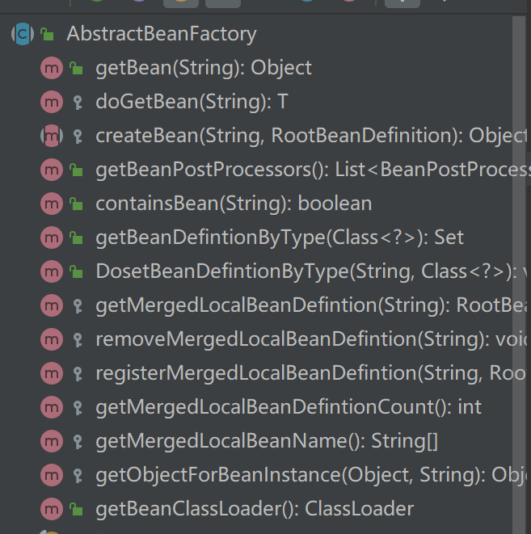
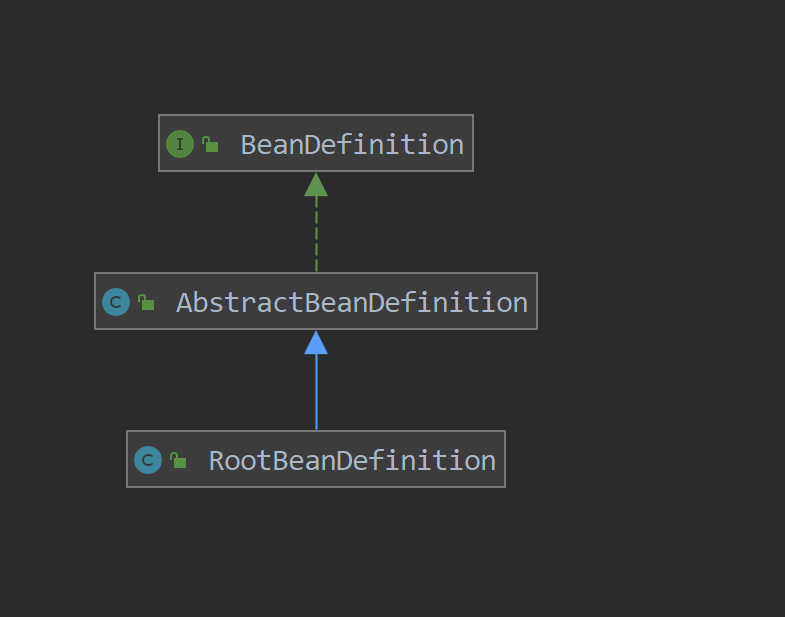

# Spring IOC

## **原理**：

**控制反转，具体来说即为将对对象的创建交给第三方来控制，我们只需要将Bean的信息告诉第三方即可**

## **实现功能：**

**由XML进行Bean的配置**

**支持由普通方法或者FactoryBean来创建Bean**

**支持property参数的以下配置**：

**value：支持Java基本属性及其的封装器类**

**ref**：**支持指定id的配置，解决循环依赖问题**

**支持根据名称和类型的自动配置**

**支持单例模式和原型模式的配置（默认情况下为单例模式）**


## 具体类的说明：

**类的名称和继承关系大致根据Spring源码仿照而来，不会有太大的冲突，只是根据主要流程取消了一些类和类方法**

#### 1.Context类

**上下文是Spring的主类，IOC的流程从这里开始**




**FileSystemApplicationContext：我们通过此类产生的对象进入实际的流程中，是最上层的实现类**

**AbstarctXmlApplicationConext: 实现factory的加载和对XML文件的读取中的对接方法**


**AbstarctRefreshableApplicationContext:实现在refresh()中创建factory和加载factory的对接方法**


**AbstractApplicationContext:实现refresh的具体流程**


#### 2.BeanFactory类

**关于Bean的创建流程从这里开始**


**DefaultListableBeanFactory:  ** **Factory最上层的实现类，被Context所创建**


**AbstractAutowireCapableBeanFactory: 实现从Bean的创建到参数注入到初始化的一系列工作**


**AbstractBeanFactory: ** **实现取得BeanDefintion到Bean的创建之间的工作**


****  


#### 3.BeanDefinition类

**XML文件配置的Bean信息都保存在这里**




**RootBeanDefintion：BeanFactory和BeanDefinitionReader使用的最上层实现类，未实现任何方法，主要用来与Spring中的类保持一致**

**AbstractBeanDefinition：实现关于Bean信息的set，get方法**


## 具体流程：

#### **1.context启动**和创建BeanFactory

**首先创建FileSystemApplicationContext**

```JAVa
public static void main(String[] args) {
    FileSystemApplicationContext applicationContext=new FileSystemApplicationContext("classpath:application.xml");
    Boss boss=(Boss)applicationContext.getBean("boss");
    boss.say();

}
```

**触发refresh（）方法**


#### 2.读取XML文件加载BeanDefinition并注册


**增添BeanFactory开始XML的加载**

```java
public void refresh() throws BeansException {
//        增添BeanFactory
        ConfigurableListableBeanFactory beanFactory=obtainFreshBeanFactory();
//         注册beanProcesssors
        registerBeanPostProcessors(beanFactory);
//        结束Factory的构建
        finishBeanFactoryInitialization(beanFactory);
    }
```


**从loadBeanDefintion进入加载信息并传入BeanFactory中**

```
protected void refreshBeanFactory() {
    DefaultListableBeanFactory beanFactory = createBeanFactory();
    loadBeanDefinitions(beanFactory);
    this.beanFactory=beanFactory;
}
```

**根据路径location 进入资源加载中**

```
public int loadBeanDefinitions(String location) {
  Resource resource=getResourceLoader().getResource(location);
  int count=loadBeanDefinitions(resource);
  return count;
}
```


**真正的XML信息解析在BeanDefinitionDocumentReader**

```
private void processBeanDefinition(Element ele, BeanDefinitionParserDelegate delegate) {
    BeanDefinitionHolder bdHolder= delegate.parseBeanDefinitionElement(ele);
    registerBeanDefinition(bdHolder,beanDefinitionReader.getRegistry());
}
```

**流程为先提取Bean的Id，继续解析Bean的属性和子元素**

```
public BeanDefinitionHolder parseBeanDefinitionElement(Element ele) {
    String id= ele.getAttribute(ID_ATTRIBUTE);
    String beanName=id;

    try {
        RootBeanDefinition beanDefiniton=parseBeanDefinitionElement(ele,beanName);
        return  new BeanDefinitionHolder(beanDefiniton,beanName);
    } catch (XMLParseException e) {
        e.getCause();
    }
   return null;
}
```

```
private RootBeanDefinition parseBeanDefinitionElement(Element ele, String beanName)throws XMLParseException{
        if(!ele.hasAttribute(CLASS_ATTRIBUTE))
        {
            throw new XMLParseException("not found bean's class");
        }
        String className=ele.getAttribute(CLASS_ATTRIBUTE);
        RootBeanDefinition bd = createBeanDefinition(className);
//        解析属性
        parseBeanDefinitionAttributes(ele, beanName,bd);
//        解析参数元素
        parsePropertyElements(ele, bd);
        return bd;
    }
```


**解析完成后将BeanDefinition交给Holder类承载**

```
public BeanDefinitionHolder parseBeanDefinitionElement(Element ele) {
    String id= ele.getAttribute(ID_ATTRIBUTE);
    String beanName=id;

    try {
        RootBeanDefinition beanDefiniton=parseBeanDefinitionElement(ele,beanName);
        return  new BeanDefinitionHolder(beanDefiniton,beanName);
    } catch (XMLParseException e) {
        e.getCause();
    }
   return null;
}
```


**最终注入BeanFactory中**


```
private void registerBeanDefinition(BeanDefinitionHolder bdHolder, BeanDefinitionRegistry registry) {
        String beanName = bdHolder.getBeanName();
        registry.registerBeanDefinition(beanName,bdHolder.getBeanDefinition());
//        注册BeanDefinition和名称的映射关系
        Class c=bdHolder.getBeanDefinition().getBeanClass();
//        注册名称和类别的映射关系map
        registry.setBeanDefintionByType(beanName,c);

    }
```


#### 3.预加载单例Bean

 **在Context refresh的最后阶段预加载单例Bean** 


```
public void preInstantiateSingletons() {
            for(Map.Entry<String,RootBeanDefinition> entry:MergedBeanDefinitions.entrySet())
            {
                if(entry.getValue().isSingleton())
                {
                    getBean(entry.getKey());
                }
            }
}
```


**查看是否已经创建出来，如果没有则从BeanDefinitionmap中取得BeanDefintion创建新的Bean**

```
 protected  <T> T doGetBean(final String beanName)
    {
//        从缓存中获取
        Object sharedInstance=getSingleton(beanName);
        Object bean;
        if(sharedInstance!=null)
        {
            bean=getObjectForBeanInstance(sharedInstance, beanName);
        }
//        缓存中不存在创建一个全新的Bean
        else
        {
            final RootBeanDefinition mbd = getMergedLocalBeanDefintion(beanName);
            if (mbd.isSingleton()) {
                sharedInstance = getSingleton(beanName, new ObjectFactory<Object>() {
                    @Override
                    public Object getObject() throws BeansException {

                            return createBean(beanName, mbd);


                    }
                });
                bean = getObjectForBeanInstance(sharedInstance,beanName);
            }
            else if (mbd.isPrototype()) {
                Object prototypeInstance = null;
                prototypeInstance = createBean(beanName, mbd);
                bean = getObjectForBeanInstance(sharedInstance,beanName);
            }
            else  bean=null;
        }


            return (T)bean;
    }
```


##### **创建Bean的步骤**

**1.创建Bean的包装类BeanWrapper，并且根据包装类创建实例Bean**

**2.增加单例Bean构造工厂,用于三层缓存**

**3.给bean添加参数**

**4.bean最终初始化**

```
 protected  Object doCreateBean(String beanName,RootBeanDefinition mbd)
    {

        BeanWrapper instanceWrapper = null;
//        创建包装bean的类
        instanceWrapper = createBeanInstance(beanName, mbd);
        final Object bean = (instanceWrapper != null ? instanceWrapper.getWrappedInstance() : null);
//        增添单例Bean构造工厂，用于三层缓存
        if(mbd.isSingleton())
        {
            addSingletonFactory(beanName, new ObjectFactory<Object>() {
                @Override
                public Object getObject() throws BeansException {
                    return bean;
                }
            });
        }

        //给bean添加参数
    populateBean(beanName, mbd, instanceWrapper);

//    bean最后初始化
        Object finalObject=initializeBean(bean,beanName);

         return finalObject;
    }
```


## 具体问题的实现原理

#### **1.ByName和ByType的自动配置**

```
void autowireByName(String beanName, RootBeanDefinition mbd, BeanWrapper bw, MutablePropertyValues newPvs) {
//        非基本参数并且并未直接设置参数对应的值的抽取
        String[] propertyNames = unsatisfiedNonSimpleProperties(mbd, bw);
        for (String propertyName : propertyNames) {
            if (containsBean(propertyName)&&beanName!=propertyName) {
                newPvs.add(propertyName, getBean(propertyName));

            }
            }
        }
```


```
private void autowireByType(String beanName, RootBeanDefinition mbd, BeanWrapper bw, MutablePropertyValues newPvs) {
    //        非基本参数并且并未直接设置参数对应的值的抽取
    String[] propertyNames = unsatisfiedNonSimpleProperties(mbd, bw);
    for (String propertyName : propertyNames) {
        PropertyDescriptor pd=bw.getPropertyDescriptor(propertyName);
        Set<String>TypeSet=getBeanDefintionByType(pd.getPropertyType());
        for(String name:TypeSet)
        {
            if(name!=beanName) {
                newPvs.add(propertyName, getBean(name));
                break;
            }
        }

    }
}
```


**ByName：实际直接根据PropertyName创建Bean即可**

**ByType：维持一个map，名为classBeanDefinitionMap，Key为Class类型，Value为RootBeanDefinition类型，在注册BeanDefinition时，根据Bean类型注册进入map**


```
 private void registerBeanDefinition(BeanDefinitionHolder bdHolder, BeanDefinitionRegistry registry) {
        String beanName = bdHolder.getBeanName();
        registry.registerBeanDefinition(beanName,bdHolder.getBeanDefinition());
//        注册BeanDefinition和名称的映射关系
        Class c=bdHolder.getBeanDefinition().getBeanClass();
//        注册名称和类别的映射关系map
        registry.setBeanDefintionByType(beanName,c);

    }
```

#### **2.循环引用问题**

**循环引用是由于A引用B，B引用A而导致的单线程创建死循环问题，函数将在参数注入时一直调用getBean方法**

**解决方法：采用三层缓存**

```
private final Map<String,Object> singletonObjects=new ConcurrentHashMap<>();

private  final Map<String,Object> earlySingletonObjects=new ConcurrentHashMap<>();

private  final Map<String, ObjectFactory<?>>singletonFactories=new HashMap<String, ObjectFactory<?>>(16);
```

**一层缓存：singletonObjects**
**二层缓存：erarlySingletonObjects**
**三层缓存：singletonFactories**


```
private Object getSingleton(String beanName, boolean allowEarlyReference) {
//        首先从一层缓存取值
        Object singletonObject = this.singletonObjects.get(beanName);
        if (singletonObject == null && isSingletonCurrentlyInCreation(beanName)) {
//            如果不存在则从二层缓存取值
            synchronized (this.singletonObjects) {
                singletonObject = this.earlySingletonObjects.get(beanName);
                if (singletonObject == null && allowEarlyReference) {
//                    如果还是不存在则利用三层缓存的工厂创建Bean
                    ObjectFactory<?> singletonFactory = this.singletonFactories.get(beanName);
                    if (singletonFactory != null) {
                        singletonObject = singletonFactory.getObject();
                        this.earlySingletonObjects.put(beanName, singletonObject);
                        this.singletonFactories.remove(beanName);
                    }
                }
            }
        }
        return (singletonObject != NULL_OBJECT ? singletonObject : null);
    }
```


**在三层缓存创建完后将未完成的Bean移到二层缓存，而当Bean创建完成后会将二层，三层的Bean删除，留在一层缓存中**

```
 private   void addSingleton(String beanName, Object singletonObject) {
        synchronized (this.singletonObjects) {
            this.singletonObjects.put(beanName, (singletonObject != null ? singletonObject : NULL_OBJECT));
            this.singletonFactories.remove(beanName);
            this.earlySingletonObjects.remove(beanName);
//            this.registeredSingletons.add(beanName);
        }

    }
```

**所以我们只要将三层缓存的singleFactory工厂放在Bean的创建过程中即可，但必须保证在Bean的参数注入前，这样才能起作用，实际也是如此**

```
BeanWrapper instanceWrapper = null;
//        创建包装bean的类
        instanceWrapper = createBeanInstance(beanName, mbd);
        final Object bean = (instanceWrapper != null ? instanceWrapper.getWrappedInstance() : null);
//        增添单例Bean构造工厂，用于三层缓存
        if(mbd.isSingleton())
        {
            addSingletonFactory(beanName, new ObjectFactory<Object>() {
                @Override
                public Object getObject() throws BeansException {
                    return bean;
                }
            });
        }

        //给bean添加参数
        populateBean(beanName, mbd, instanceWrapper);

//    bean最后初始化
        Object finalObject=initializeBean(bean,beanName);

        return finalObject;
```


## 总结

